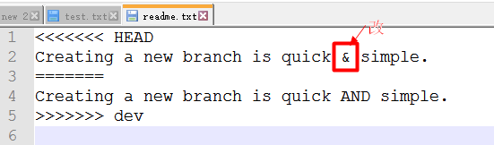
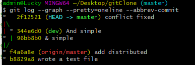
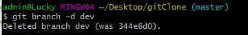

操作流程：
- 1、[创建分支，修改文件，用分支提交](#git-01)
- 2、[切换到主分支，修改文件（与分支的不一样），提交](#git-02)
- 3、[合并起来（有冲突），查看冲突部分](#git-03)
- 4、[改冲突部分](#git-04)
- 5、[再次提交](#git-05)
- 6、[查看分支的合并情况--日志](#git-06)
- 7、[删除分支](#git-07)

---

# <a name="git-01" href="#" >1、创建分支，修改文件，用分支提交</a>
- 命令
```shell
git checkout -b feature1 #创建分支
```
- 修改readme.txt文件:
```shell
Creating a new branch is quick AND simple.
```
- 命令
```shell
git add readme.txt #添加到索引库中
git commit -m "AND simple" #提交
```
# <a name="git-02" href="#" >2、切换到主分支，修改文件（与分支的不一样），提交</a>
- 命令
```shell
git checkout master #切换到主分支
```
- 修改readme.txt文件:
```shell
Creating a new branch is quick & simple.
```
- 命令
```shell
git add readme.txt #添加到索引库中
git commit -m "& simple" #提交
```
# <a name="git-03" href="#" >3、合并分支（有冲突），查看冲突部分</a>
- 命令
```shell
git merge feature1 #合并分支
git diff HEAD -- readme.txt #查看冲突部分
```
# <a name="git-04" href="#" >4、改冲突部分</a>



# <a name="git-05" href="#" >5、再次提交</a>
- 命令`
``shell
git add readme.txt
git commit -m "conflict fixed"
```
# <a name="git-06" href="#" >6、查看分支的合并情况--日志</a>
- 命令
```shell
git log --graph --pretty=oneline --abbrev-commit
```

# <a name="git-07" href="#" >7、删除分支</a>
- 命令
```shell
git branch -d feature1
```

