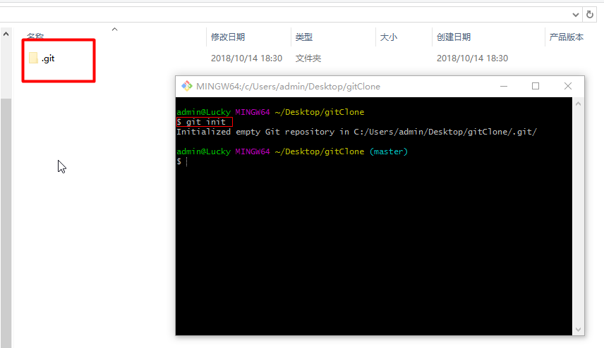
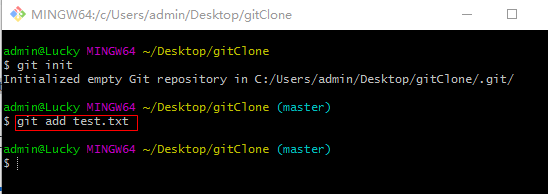
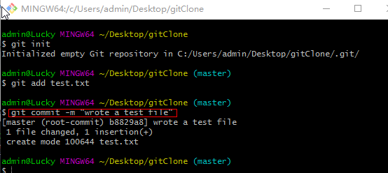

操作总流程：
- 1、[目录变成Git可以管理的仓库](#git-01)
- 2、[文件添加到仓库](#git-02)
- 3、[把文件提交到仓库](#git-03)

---

# <a name="git-01" href="#" >1、目录变成Git可以管理的仓库</a>
```shell
git init
```
`注：新建一个文件夹右键选择"Git Bash Here"对文件夹初始化, 之后生成一个.git的文件`

- 效果展现：



# <a name="git-02" href="#" >2、文件添加到仓库</a>
创建gitClone目录，创建test.txt文件，添加内容如下

```shell
这是一个测试文件
```

`注：test.txt文件放到gitClone目录下，使用utf-8格式编写文件`

- 命令如下：

```shell
git add test.txt
```

`注:进入到存放文件的地方执行命令`

# <a name="git-03" href="#" >3、把文件提交到仓库</a>
```shell
git commit -m "wrote a test file"
```

- 效果展现：

