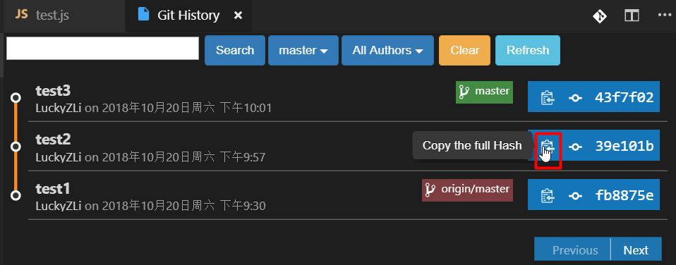
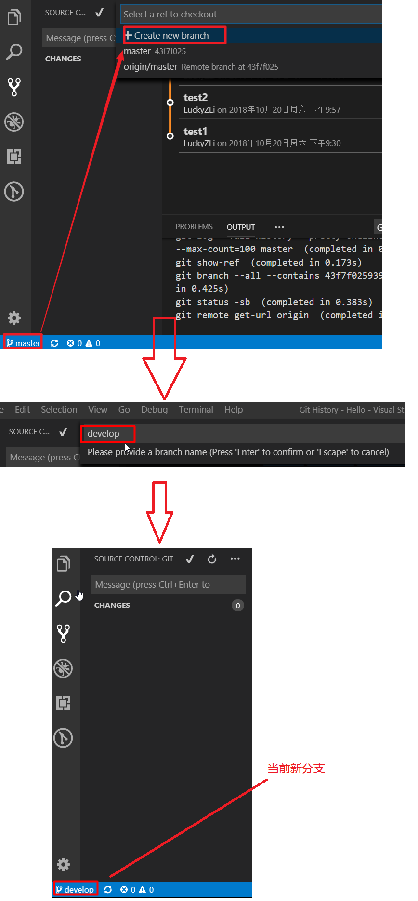
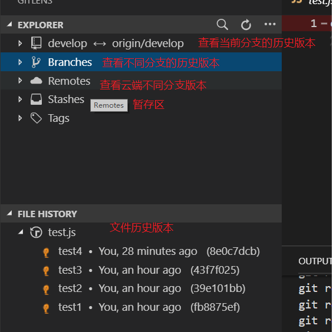

操作总流程：
- 1、[前期准备](#git-01)
- 2、[相关概念](#git-02)
- 3、[Git常用指令](#git-03)
- 4、[Basic Flow](#git-04)
- 5、[详细操作步骤，Local 和 Remote 都在本地电脑模拟](#git-05)

---

# <a name="git-01" href="#" >1、前期准备</a>
* 客户端安装`Git`   
* vs code 安装`GitLens`和`GitHistory`  

---

# <a name="git-02" href="#" >2、相关概念</a>
* Working Directory - 档案工作目录
* Staging Area - 档案暂存区
* Local Repository - 本地仓库
* Remote Repository - 云端仓库

---

# <a name="git-03" href="#" >3、Git常用指令</a>
1. [Local] git add 到 staging area。
2. [Local] git commit 到 local repo。
3. [Remote] git push 到 remote repo。
4. [Remote] git clone 从 remote repo 复制到 local Repository (初始化本地仓库)。
5. [Local] git checkout 从 local repo 到 working directory。
6. [Remote] git fetch 查看 remote Repository 的版本变化。
7. [Local] git merge 从 local Repository 合并到 working directory。
8. [Remote] git pull 效果等于 git fetch + git merge。

---

# <a name="git-04" href="#" >4、Basic Flow</a>
1. Create a project (IT leader or PM)   
2. Clone from Remote (check Remote & Local)   
3. Staged to Local
4. Commit to Local (Git history)
5. Push to Remote (Git history)
6. Checkout specific version (Git status)
7. New a Branch (develop) and commit code
8. Share repository url to member than clone
9. Checkout remote (develop) branch to Local
10. Staged and Commit to Local
11. Push to Remote
12. Fetch and Merge code from Remote 

---

# <a name="git-05" href="#" >5、详细操作步骤，Local 和 Remote 都在本地电脑模拟</a>
* 本地空文件夹`Remote\Hello`   
   
* 使用vs code初始化云端仓库(切换到`Remote\Hello`目录)     
   
* 使用vs code初始化本地仓库(切换到`Local`目录)   
   
* 使用vs code打开local文件夹，新建test.js文件  
  
* 把文件加入Staging(命令: `git add test.js`(具体文件) / `git add .`(修改的全部文件))  
  
  
* commit到Local(第一版)(命令：`git commit -m message``)  
  
  
* 第一次push到Remote(命令：`git push`) 
  
  
* 继续commit到Local(第二版)  
   
  
* 继续commit到Local(第三版)  
  
   
* 切换到第二版本(命令：`git checkout Hashcode``)    
   
   
 
* 切换到master分支,(命令：`git checkout master``)  
   
* 第二次push到Remote(注意：push的时候一定要在某一个分支下进行，checkout某一个hash是无法push的 )    
   
* new 新的分支,(命令：`git branch develop``)   
   
   
* 当前分支修改文件，提交到local  
     
* 当前分支push到Remote  
   
* 使用Git History 进行查看文件历史版本  
   
   
   
* 使用Git History 进行文件历史compare  
   
   
* 使用Git Lens 进行查看文件历史版本   
     
   

  
    

  

  

 
 
 
 
 

