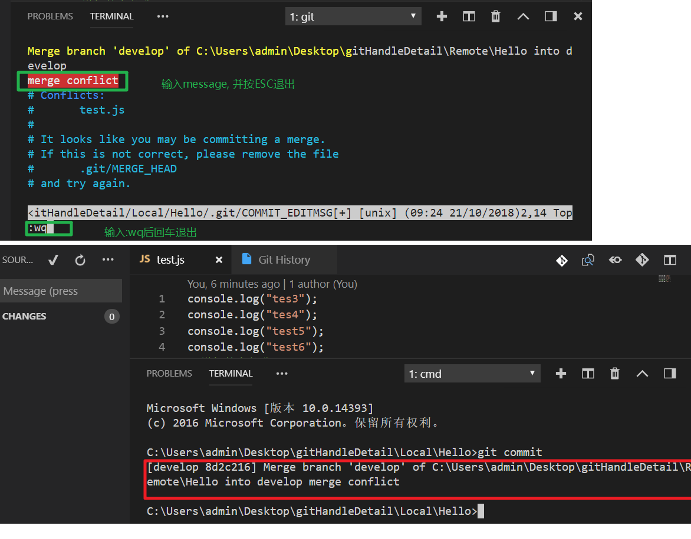

操作总流程：
- 1、[Git Advance操作](#git-01)
- 2、[详细操作步骤，Local、Lucky 和 Remote 都在本地电脑模拟](#git-02)

---

# <a name="git-01" href="#" >1、Git Advance操作</a>
1. Merge if conflict (conflict pattern)
* Mine(保留自己的)
* Theirs(保留Remote存在的)
* Manually(手动设置)
2. Git reset (before PUSH, haved already commit to local)(如果不写参数默认是Mixed)
* soft(从commit状态回到档案暂存区)
* mixed(从commit状态回到档案暂存区之前的状态，即没有加入到档案暂存区)
* hard(全部恢复到修改前的状态，类似于TFS的(Undo)功能，此操作慎用)
3. Switch branch before commit
* Commit then reset
* Discard
* Stash 

---

# <a name="git-02" href="#" >2、[详细操作步骤，Local、Lucky 和 Remote 都在本地电脑模拟]</a>   
* 两个不同的开发者针对同一个文件在同一分支下进行，开发者一已经push Remote, 当开发者二准备push Remote出现版本冲突  
  
  
  
* 保留当前  
   
* 直接输入指令`git commit`，弹出提示按住<kbd>I</kbd>键，输入内容，然后按住<kbd>ESC</kbd>键退出，接着输入`:wq`后敲回车  
   
  
* 注意点   
  
* Git reset(before push)操作  
  
---
  
---
  
---
  
---
* Git reset(before commit)操作  
  
---

  

 

  

